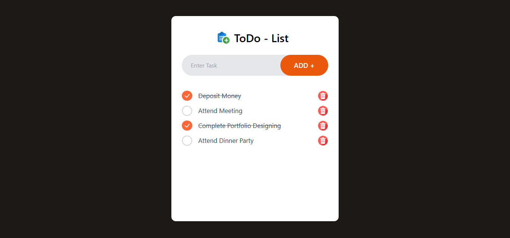

# React To-Do List App 📝✨

Welcome to the **React To-Do List App**! This project is a beautifully designed and highly functional to-do list application with a stunning UI and delightful emojis to make task management enjoyable and engaging. 🚀

## 🌟 Features

- **Modern UI**: A sleek and intuitive design for a seamless user experience.
- **Add Tasks**: Quickly add your tasks with ease.
- **Edit & Delete**: Effortlessly modify or remove tasks as needed.
- **Mark as Complete**: Check off completed tasks with a satisfying animation. ✅
- **Persistent Storage**: Tasks are saved locally, so you won't lose them on refresh.
- **Responsive Design**: Optimized for both desktop and mobile devices. 📱💻
- **Emojis for Fun**: Emojis to make task management less boring! 😄

## 🖼️ Preview

![To-Do List Preview]


## 🛠️ Technologies Used

- **React.js**: The core framework for building the app.
- **CSS Modules**: For styling and UI responsiveness.
- **LocalStorage**: To persist user data.

## 🚀 Getting Started

Follow these steps to get the app running on your local machine:

### Prerequisites

- [Node.js](https://nodejs.org/) installed
- [Git](https://git-scm.com/) installed

### Installation

1. Clone this repository:
   ```bash
   git clone https://github.com/rahull0328/ToDo-react.git
   ```

2. Navigate to the project directory:
   ```bash
   cd todo-react
   ```

3. Install dependencies:
   ```bash
   npm install
   ```

4. Start the development server:
   ```bash
   npm run dev
   ```

5. Open your browser and navigate to `http://localhost:3000` to see the app in action. 🎉

## 🤝 Contribution

Contributions are welcome! 🎉 If you have suggestions or want to report bugs, feel free to open an issue or create a pull request.

## 💡 Future Enhancements

- Add a dark mode 🌙
- Integrate with a backend API for multi-device sync 🌐
- Add categories or tags for tasks 🏷️

## 🌈 Acknowledgments

Special thanks to the open-source community for the amazing tools and resources that made this project possible. 🙌

---

**Made with ❤️ and React by [rahull0328](https://github.com/rahull0328)**
